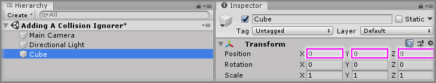
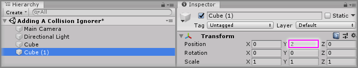
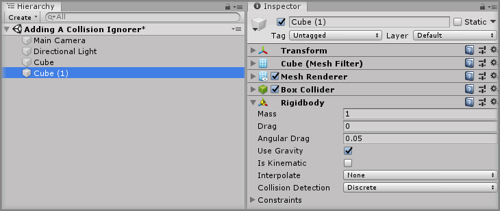
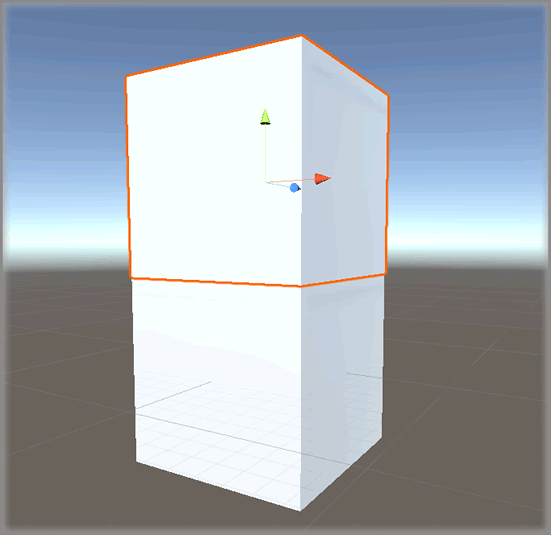
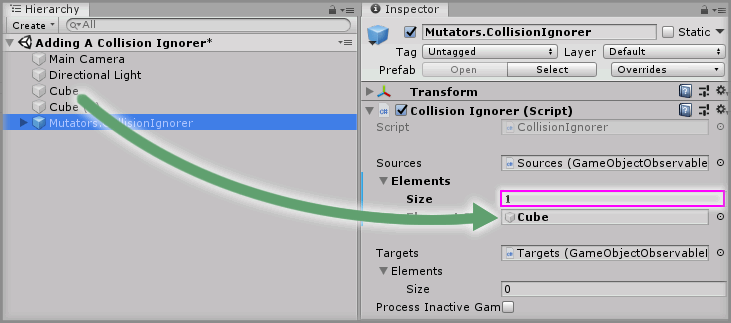
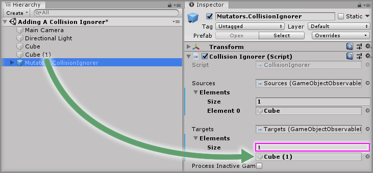

# Adding A Collision Ignorer

> * Level: Beginner
>
> * Reading Time: 5 minutes
>
> * Checked with: Unity 2018.3.14f1

## Introduction

The `Mutators.ColliisonIgnorer` prefab provides a way of allowing two or more objects to ignore collisions with each other.

## Prerequisites

* [Install the Tilia.Mutators.CollisionIgnorer.Unity] package dependency in to your [Unity] project.

## Let's Start

### Step 1

Create a new `Cube` Unity 3D Object by selecting `Main Menu -> GameObject -> 3D Object -> Cube` and change the `Transform` properties to:

* Position: `X = 0`, `Y = 0`, `Z = 0`

### Step 2

Create another new `Cube` Unity 3D Object by selecting `Main Menu -> GameObject -> 3D Object -> Cube` and change the `Transform` properties to:

* Position: `X = 0`, `Y = 2`, `Z = 0`

### Step 3

Click the `Add Component` button and select the `Rigidbody` component to add a `Rigidbody` to `Cube (1)`. 

Play the Unity scene and you should see `Cube(1)` land on top of `Cube` because the colliders on each cube will prevent them passing through each other.

### Step 4

Add a `Mutators.ColliisonIgnorer` prefab to the Unity project hierarchy by selecting `GameObject -> Tilia -> Prefabs -> Mutators -> Mutators.ColliisonIgnorer` from the Unity main top menu.

### Step 5

Select the `Mutators.CollisionIgnorer` GameObject in the Unity Hierarchy window then increase the `Sources -> Elements > Size` property value by `1` on the `Collision Ignorer` component.

Drag and drop the `Cube` GameObject into the newly displayed `Element 0` property value within the `Sources` property on the `Collision Ignorer` component.

### Step 6

Increase the `Targets -> Elements -> Size` property value by `1` on the `Collision Ignorer` component.

Drag and drop the `Cube (1)` GameObject into the newly displayed `Element 0` property value within the `Targets` property on the `Collision Ignorer` component.

Play the Unity scene you should see `Cube (1)` fall right through `Cube` this is because the collisions between the two GameObjects is now being ignored.

### Done 

You should now have two objects that are no longer able to collide with each other.

[Install the Tilia.Mutators.CollisionIgnorer.Unity]: ../Installation/README.md
[Unity]: https://unity3d.com/